# 
TMS

## 
Lesson-02

Задание 1:
1. Настроил файл gitconfig
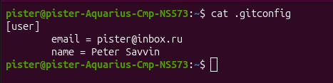
2. Создал свой приватный репозиторий с названием tms-git
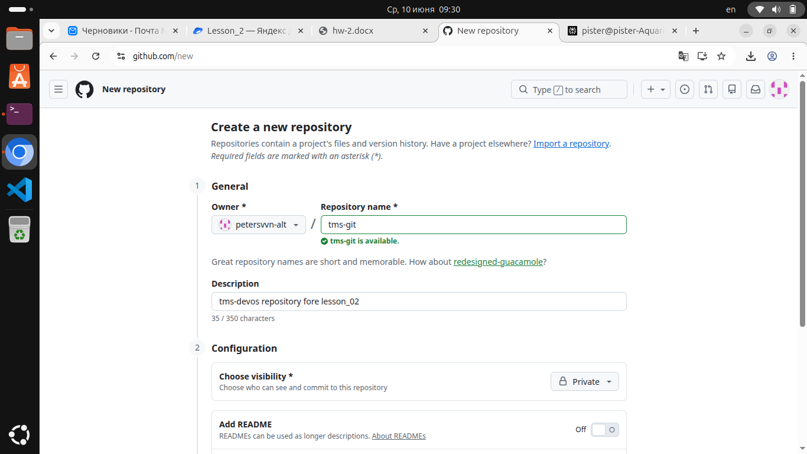
3. Склонировал репозиторий к себе на компьютер
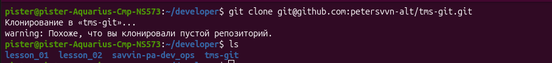
4. Скачал и распоковал архив.
● Сделал файлы папки wild_animals отслеживаемыми
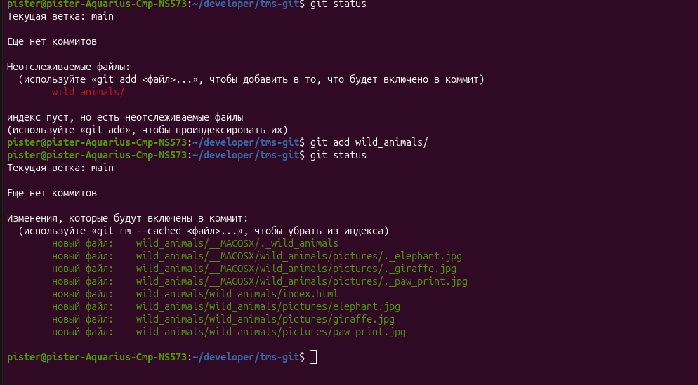
● Сделал коммит и посмотрел хэш коммита
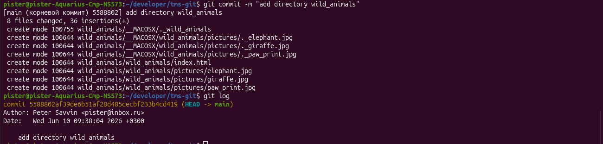
5. Сделал 2й коммит
● Исправил опечатку в файле index.html
● Добавил изменения в индекс
● Сделал коммит с месседжем
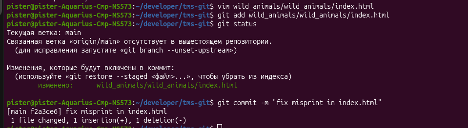

Задание 2:
1. Склонировал репозиторий geometric_lib
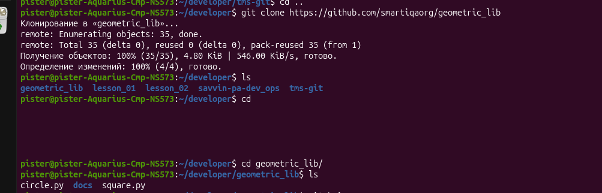
2. Ознакомился со структурой коммитов
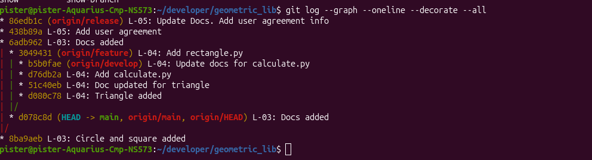
3. Откатил неудачный коммит в ветке feauture использовав ``git revert`` с сохранение истории
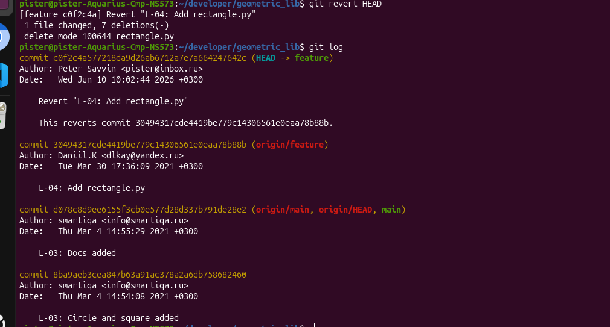
4. Объединил коммиты в ветке develop через ``git rebaiss -i``
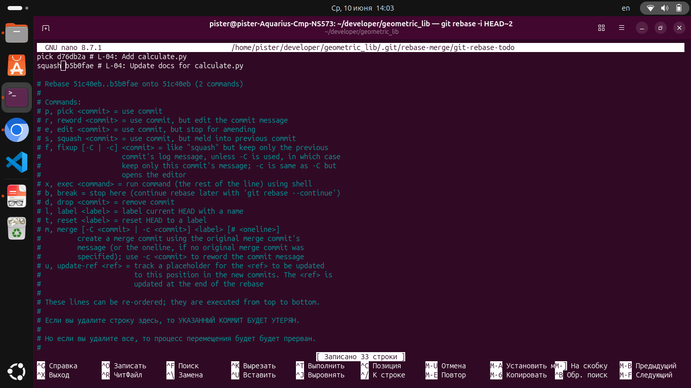
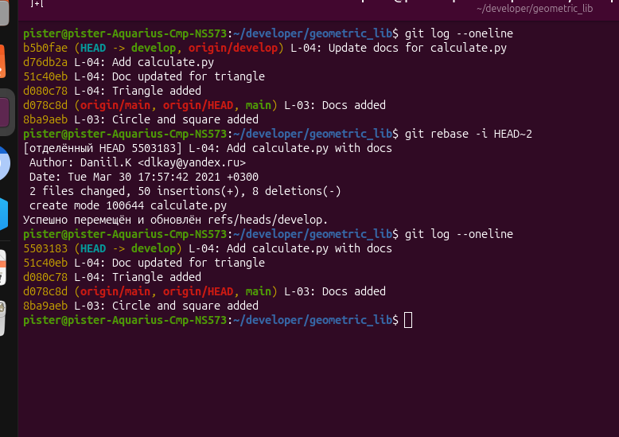
5. Создал новую ветку с именем experiment
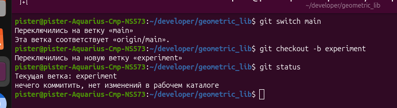
6. Копирую файл decs/README.md из последнего коммита ветки develop. Делаю коомит.
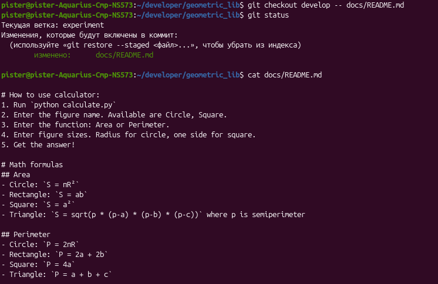
7. Копирую файл calculate.py из ветки develop. Добавляю в индекс и делаю коммит
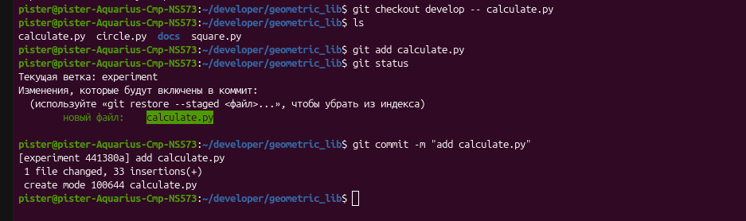
8. Удаляю файлы circle.py и square.py и делаю коммит
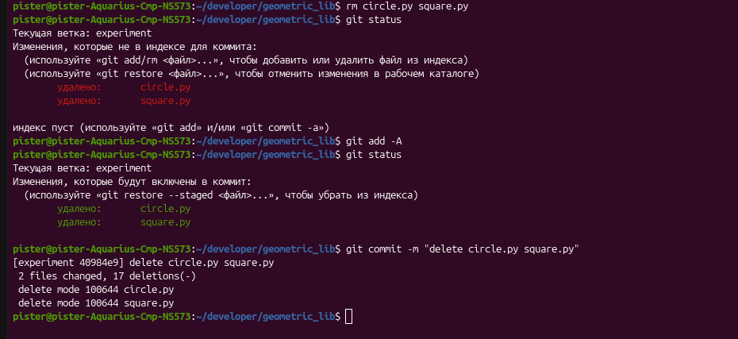